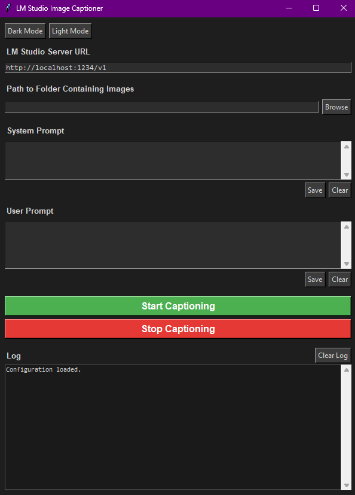

# LM_Studio_Image_Captioner

A simple desktop tool for automatically generating captions for image datasets using a locally running Vision Language Model (VLM) via [LM Studio](https://lmstudio.ai/). Ideal for preparing datasets for diffusion model fine-tuning, LoRA, or LoCon/LoKr training.



---

## Features

- **Local & Private** — runs entirely on your machine using LM Studio, no cloud API needed
- **Batch Processing** — automatically captions all images in a folder
- **Supports** `.png`, `.jpg`, `.jpeg`, `.webp`
- **Custom Prompts** — set your own system prompt and user prompt for full control over caption style
- **Skip Existing** — skips images that already have a caption file, safe to re-run
- **Thinking Model Support** — automatically strips `<think>...</think>` blocks from reasoning models
- **Dark & Light Mode**
- **Config Persistence** — saves your settings (URL, folder path, prompts, theme) between sessions

---

## Requirements

- [LM Studio](https://lmstudio.ai/) with a VLM loaded and the local server running
- **To run from source:** Python 3.8+ with the `requests` library (`pip install requests`)
- **To run the executable:** No Python needed — just download and run

---

## Getting Started

### Step 1 — Set up LM Studio

1. Open **LM Studio**
2. Go to the **Developer** tab (or Server tab)
3. Load a Vision Language Model
4. Click **Start Server** — it runs at `http://localhost:1234` by default

### Step 2 — Run the Captioner

**Option A — Executable (easiest):**
Download `LM_Studio_Image_Captioner.exe` from the [Releases](../../releases/latest) page and run it directly. No installation required.

**Option B — From source:**
```bash
pip install requests
python LM_Studio_Image_Captioner.py
```

### Step 3 — Caption Your Images

1. Make sure the **LM Studio server URL** matches (default: `http://localhost:1234/v1`)
2. Click **Browse** to select the folder containing your images
3. (Optional) Enter a **System Prompt** and **User Prompt** to control caption style
4. Click **Start Captioning**

For each image, a `.txt` file with the same name will be created in the same folder:
```
dataset/
├── image_001.png
├── image_001.txt   ← generated caption
├── image_002.jpg
├── image_002.txt   ← generated caption
...
```

---

## Notes

- The tool will **skip** any image that already has a corresponding `.txt` caption file
- You can stop processing at any time with the **Stop** button — it will finish the current image first before stopping
- Settings are saved automatically to `caption_config.json` in the same directory as the app

---

## License

MIT License — free to use, modify, and distribute.
